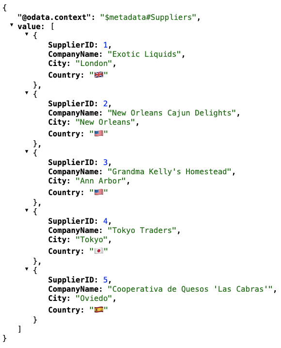

# 03 - Creating a plugin

The plugin concept is fundamental to the CAP framework. Not only as a clean and
simple extension mechanism, but also a core building block in the framework
itself. Various basic components in CAP are implemented as plugins, as well as
[many additional features](https://cap.cloud.sap/docs/plugins/).

In this exercise we'll implement a simple plugin so that we understand how
they're put together and how they work.

## Start a new CAP project

Like we did in an earlier exercise, we'll start with the "base project" to save
a bit of time.

👉 Create a new project directory for this exercise using the base project:

```bash
rm -rf proj-03 \
  && cp -a baseproj proj-03 \
  && cd $_
  && tree
```

## Install the runtime

Normally this point in a project would be too early to think about installing
the `@sap/cds` runtime and the rest of the project dependencies. But we'll do
it here because it makes things simpler in terms of paths (relative and
absolute) when we come to looking at some `@sap/cds` runtime components. It's
easier to refer to and view them relative to (within) our `proj-03/` project
directory, than in a global install location elsewhere.

👉 Install the package dependencies for the project:

```bash
npm install
```

## Explore plugins as core building blocks

Let's see if we can find evidence of the plugin concept being used in the core
framework. We can turn on debugging for the plugins module and have a look.

👉 Start up the server with the `DEBUG` environment variable set to `plugins`:

```bash
DEBUG=plugins cds watch
```

Some interesting output appears in the server log, like this:

```log
[cds.plugins] - fetched plugins in: 1.401ms
[cds.plugins] - loading @sap/cds-fiori: {
  impl: 'node_modules/@sap/cds-fiori/cds-plugin.js'
}
[cds.plugins] - loading @cap-js/sqlite: {
  impl: 'node_modules/@cap-js/sqlite/cds-plugin.js'
}
[cds.plugins] - loaded plugins in: 3.791ms
[cds] - loaded model from 2 file(s):

  srv/main.cds
  db/schema.cds

...
[cds] - server listening on { url: 'http://localhost:4004' }
[cds] - server v9.9.1 launched in 286 ms
```

We can see there are two plugins being fetched and loaded:

- `@sap/cds-fiori`
- `@cap-js/sqlite`

So let's investigate where these plugins (mentioned at the start of the CAP
server log output) are coming from and why they're being loaded.

### Look at the dependent packages

If we dig in (see the [Further info](#further-info) section), we'll see that
the core plugin mechanism looks for package dependencies for two key locations:

- [cds.home](https://cap.cloud.sap/docs/node.js/cds-facade#cds-home): the
  location of the in-use `@sap/cds` runtime (which we've just installed and
  therefore is within the project's `node_modules/` directory)
- [cds.root](https://cap.cloud.sap/docs/node.js/cds-facade#cds-root): the
  project root directory

#### Determine the home and root values

Use the cds REPL to confirm what the values are for your setup.

👉 Start the cds REPL:

```bash
cds repl
```

👉 At the prompt, ask for the values of both `cds.home` and `cds.root`.

You should see something like this:

```log
node ➜ /workspaces/cap-tour-hands-on (main) $ cds repl
Welcome to cds repl v9.9.1
> cds.home
/workspaces/cap-tour-hands-on/proj-03/node_modules/@sap/cds
> cds.root
/workspaces/cap-tour-hands-on/proj-03
>
```

Depending on your setup, the values, especially the first parts of the paths,
may be different. But the key thing is that they're both, (literally)
relatively speaking, easily accessible from where you are right now in
`proj-03/`:

- `cds.home` is `./node_modules/@sap/cds`
- `cds.root` is `.`

#### Look at the dependencies

Now we know the actual locations, let's take a look at the dependencies - these
will be listed in `dependencies` and `devDependencies` sections within the
`package.json` files in each of these two locations.

👉 List the dependencies of both these locations:

```bash
jq '.name, .dependencies + .devDependencies' \
  ./node_modules/@sap/cds/package.json \
  ./package.json
```

This should produce something like this:

```json
"@sap/cds"
{
  "@sap/cds-compiler": "^6.4",
  "@sap/cds-fiori": "^2",
  "express": "^4.22.1 || ^5",
  "yaml": "^2"
}
"baseproj"
{
  "@sap/cds": "^9",
  "@cap-js/sqlite": "^2.4"
}
```

### Look for signs of plugins

We know from Capire (see the [Further info](#further-info) section) that the
key file that makes your package a plugin, like the "index" file in other
contexts, is `cds-plugin.js`. So let's see whether we can find any instance of
such a file.

👉 Look for `cds-plugin.js` files in `cds.home` and `cds.root`:

```bash
find . -name cds-plugin.js 
```

and bingo - we have two, both in `cds.home` (in the `@sap/cds` runtime):

```log
./node_modules/@sap/cds-fiori/cds-plugin.js
./node_modules/@cap-js/sqlite/cds-plugin.js
```

And yes, these are `cds-plugin.js` files in packages that exactly match those
we saw in the CAP server log output. And, also yes, the SQLite module is
implemented ... as a plugin.

## Build the skeleton of our own plugin

Now we know what we need - a package with a `cds-plugin.js` file - let's create
one. Even here we can embrace the local-first development mode that CAP
celebrates by using NPM's "workspaces" concept (see [Further
info](#further-info)), which will allow us to create the plugin locally but
still "require" it via the normal `package.json#dependencies` route.

> [!NOTE]
> What will the plugin do? Well, let's keep it super simple so we can focus on
> the plugin mechanics. It should replace values with the corresponding flag
> emojis, for elements that have been marked with a `@flagify` annotation. An
> essential enterprise feature, I'm sure you'll agree!

### Create the plugin package directory

👉 Create a new package for the plugin by initialising a new package in the
context of a new workspace called "flags":

```bash
npm init \
  --yes \
  --workspace flags
```

This should emit something like this:

```log
Wrote to [...]/proj-03/flags/package.json:

{
  "name": "flags",
  "version": "1.0.0",
  "description": "",
  "main": "index.js",
  "devDependencies": {},
  "scripts": {
    "test": "echo \"Error: no test specified\" && exit 1"
  },
  "keywords": [],
  "author": "",
  "license": "ISC",
  "type": "commonjs"
}

added 1 package in 312ms
```

Perhaps more interestingly, it's also caused the addition of a new `workspaces`
section in `proj-03`'s `package.json`:

```json
{
  "name": "baseproj",
  "version": "1.0.0",
  "dependencies": {
    "@sap/cds": "^9"
  },
  "devDependencies": {
    "@cap-js/sqlite": "^2.4"
  },
  "scripts": {
    "start": "cds-serve"
  },
  "private": true,
  "workspaces": [
    "flags"
  ]
}
```

Let's also make sure we understand the structure of what's been created, and
where.

👉 Have a look:

```bash
tree -F -I node_modules
```

This should show something like this, where we can see that our new package is
in its own `flags/` directory:

```log
./
├── db/
│   ├── data/
│   │   ├── northwhisper-Categories.csv
│   │   ├── northwhisper-Products.csv
│   │   └── northwhisper-Suppliers.csv
│   └── schema.cds
├── flags/
│   └── package.json
├── package-lock.json
├── package.json
└── srv/
    └── main.cds

5 directories, 11 files
```

### Add some startup logging

For this skeleton step, all we want to do is get the plugin to announce itself.

👉 Create a new file in the plugin directory (`flags/`) called `cds-plugin.js`
with this content:

```javascript
const cds = require('@sap/cds')
const log = cds.log('flags')
log('Starting up ...')
```

That should be all we need, right?

### Start up the main project

👉 Now start up the main service in `proj-03` like we did before:

```bash
DEBUG=plugins cds watch
```

We see this:

```log
[cds.plugins] - fetched plugins in: 22.209ms
[cds.plugins] - loading @sap/cds-fiori: {
  impl: 'node_modules/@sap/cds-fiori/cds-plugin.js'
}
[cds.plugins] - loading @cap-js/sqlite: {
  impl: 'node_modules/@cap-js/sqlite/cds-plugin.js'
}
[cds.plugins] - loaded plugins in: 3.791ms
```

It's essentially the same output as before.

Where's our plugin?

Well, we should know now that it's only loaded when defined as a dependency.

👉 So let's do that now (in a separate terminal):

```bash
npm add flags
```

Assuming your CAP server is still running, the restart should now emit this:

```log
[cds.plugins] - fetched plugins in: 3.949ms
[cds.plugins] - loading @sap/cds-fiori: {
  impl: 'node_modules/@sap/cds-fiori/cds-plugin.js'
}
[cds.plugins] - loading flags: { impl: 'flags/cds-plugin.js' }
[flags] - Starting up ...
[cds.plugins] - loading @cap-js/sqlite: {
  impl: 'node_modules/@cap-js/sqlite/cds-plugin.js'
}
[cds.plugins] - loaded plugins in: 5.452ms
```

Success!

### Switch the logging to debug level

So that we don't see the 'Starting up ...' all the time, let's change the log
level for that.

👉 Do that by using `log.debug` in `flags/cds-plugin.js` instead, like this:

```javascript
const cds = require('@sap/cds')
const log = cds.log('flags')
log.debug('Starting up ...')
```

## Add our custom annotation to an element

We want our plugin to replace country names with flag emojis, for elements
annotated with `@flagify`. So let's add this annotation to the supplier's
country in our model, and then we have something to look for in terms of
schema (metadata) exploration, which is what our plugin will need to do too.

Annotate the `Country` element of the `Suppliers` entity projection in the
`Main` service with `@flagify` using a directive like this, in a new file
called `srv/annotations.cds`:

```cds
using Main from './main';

annotate Main.Suppliers : Country with @flagify;
```

> Rather than annotate the entity at the schema level, this annotation is
> deliberately at the service definition level, meaning we have the chance to
> have a further projection on the `Suppliers` entity where this annotation is
> not present.

### Check how the annotation is stored

This annotation is stored simply alongside the rest of the attributes of the
element. We can check this by having a quick look at the CSN.

👉 Compile the model and extract the definition of the elements for this
entity:

```bash
cds compile srv \
  | jq '.definitions["Main.Suppliers"].elements'
```

This should emit something like this:

```json
{
  "SupplierID": {
    "key": true,
    "type": "cds.Integer"
  },
  "CompanyName": {
    "type": "cds.String"
  },
  "City": {
    "type": "cds.String"
  },
  "Country": {
    "@flagify": true,
    "type": "cds.String"
  },
  "Products": {
    "type": "cds.Association",
    "...": "..."
  }
}
```

The annotation is just another key in the properties of the `Country` element.
Neat!

## Implement the plugin logic

Now the plugin exists in its basic form, and is wired up, it's time to add the
implementation. The power of plugins and what we can do here comes from the
introspection facilities that are available to us via the CDS facade.

We can look at the definitions in our model and identify the particular parts
that we want our plugin to manipulate or otherwise operate on.

For our simple plugin here, the approach is:

- wait for the services to be compiled and the server to be bootstrapped
- look through the services and pick out those that are relevant (application
  services, effectively)
- for each service, work through the entities, and:
- if any entity has elements annotated with `@flagify`, then we want to add a
  handler to the "after" phase for reads on that entity (see [Further
  info](#further-info))
- this handler should process each record in the result set and make
  appropriate modifications to the values of those elements that have been
  annotated

### Add the country flag values

The appropriate modifications here are to replace country names with their
flags, so let's start with that.

👉 Create a file `flags/flags.json` with this content:

```json
{
  "Australia": "🇦🇺",
  "Brazil": "🇧🇷",
  "Canada": "🇨🇦",
  "Denmark": "🇩🇰",
  "Finland": "🇫🇮",
  "France": "🇮🇹",
  "Germany": "🇩🇪",
  "Italy": "🇮🇹",
  "Japan": "🇯🇵",
  "Netherlands": "🇳🇱",
  "Singapore": "🇸🇬",
  "Spain": "🇪🇸",
  "Sweden": "🇸🇪",
  "UK": "🇬🇧",
  "USA": "🇺🇸"
}
```

👉 Now make sure this is loaded in the `flags/cds-plugin.js` file and add some
debug log output:

```javascript
const cds = require('@sap/cds')
const flags = require('./flags')
const log = cds.log('flags')
log.debug('Starting up ...')
log.debug(`Flags available for ${Object.keys(flags).length} countries`)
```

### Define some helper functions

To assist with our introspection, let's next define a handful of helper
functions, all predicate functions (and one of which is partially applied, see
[Further info](#further-info)).

👉 Add these definitions straight after the `log.debug` statements:

```javascript
const isAppService = x => x.kind == 'app-service'
const isAnnotated = a => x => x[a]
const isFlagified = isAnnotated('@flagify')
```

Because of how beautifully annotations are stored, we are able to define a
simple higher order function `isAnnotated` that can be used to construct more
specific functions (such as `isFlagified`) by partially applying it.

### Define the main plugin behaviour

Now it's time for the core part of our plugin.

The CDS facade emits a one-time `served` event once all services have been
bootstrapped and are ready, so let's first specify that our logic should be
invoked then.

👉 Add this wrapper after the debug logs in `flags/cds-plugin.js`, along with the
logic within it:

```javascript
cds.once('served', _ => {

  const services = [...cds.services].filter(isAppService)

  services.forEach(s => {
    [...s.entities].forEach(en => {
      if ([...en.elements].some(isFlagified)) {
        const flagified = [...en.elements].filter(isFlagified)
        s.after('READ', en.name, records => {
          records.forEach(r =>
            flagified.forEach(el => r[el.name] = flags[r[el.name]] || r[el.name])
          )
        })
      }
    })
  })

})
```

While most of this logic is explained in part 3 of the CAP Node.js Plugins
series (see [Further info](#further-info)), it's worth spending a few moments
staring at this to understand what is being done:

- the application services are identified (`Main`)
- for each of these application services:
  - the entities are examined one by one (`Products`, `Suppliers`, `Categories`)
  - if any of the elements of the entity currently being examined have been
    annotated with `@flagify`, then:
  - those elements are collected into a list
  - then a handler for the `after` phase of reading the given entity is added
  - that handler works through the annotated elements, substituting a flag
    emoji where possible

That's about it!

## Try the plugin out

👉 Now that we have everything we need, make a request to the `Suppliers`
entity (remember we added the `@flagify` annotation to this entity's `Country`
element):

<http://localhost:4004/northwhisper/Suppliers?$top=5>

You should see the entityset, complete with flag emojis for the countries:



What's more, because this entire feature is packaged up in a plugin, we can
simply turn it off again at the package dependency level.

👉 Try that now, by removing the dependency:

```bash
npm remove flags
```

Now a re-request of the same resource will return an entityset with regular
country names.

Well done!

## Further info

- A deep dive into what causes plugins to be loaded, and from where, is
  available in the blog post [CAP Node.js plugins - part 1 - how things
  work](https://qmacro.org/blog/posts/2024/10/05/cap-node-js-plugins-part-1-how-things-work/).
- The logic in this plugin is explained in more detail in [CAP Node.js plugins -
  part 3 - writing our
  own](http://localhost:5005/blog/posts/2025/01/17/cap-node-js-plugins-part-3-writing-our-own/).
- The [CDS Plugin Packages](https://cap.cloud.sap/docs/node.js/cds-plugins)
  topic has a section on `cds-plugin.js`.
- Learn more about [NPM
  Workspaces](https://docs.npmjs.com/cli/v11/using-npm/workspaces).
- Learn about the different phases, or hooks: [on, before,
  after](https://cap.cloud.sap/docs/guides/services/custom-code#hooks-on-before-after).
- There are different [lifecycle
  events](https://cap.cloud.sap/docs/node.js/cds-server#lifecycle-events)
  emitted via the CDS facade, one of which is `served`.
- The blog post [Point free coding and function
  composition](https://qmacro.org/blog/posts/2025/05/15/point-free-coding-and-function-composition/)
  may help to provide some background to the types of functions defined as
  helpers here.
