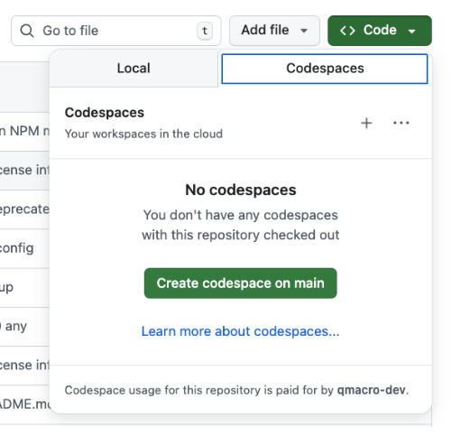

# Prerequisites

In order to work through the exercises you'll need a development environment
for CAP Node.js, with the latest versions of CDS and the CDS Development Kit
([9.9](https://cap.cloud.sap/docs/releases/2026/apr26) at the time of writing).

For this, you have a few options.

You can follow the [Getting Started](https://cap.cloud.sap/docs/get-started/)
guide in Capire (CAP's official documentation).

> If you go for this option, you'll also need to install
> [jq](https://jqlang.org/) and also `tree` (or use an equivalent).

You can clone and open this repository in a locally running VS Code where
you've installed the [Dev
Containers](https://marketplace.visualstudio.com/items?itemName=ms-vscode-remote.remote-containers)
extension.

You can use GitHub's Codespace facility to get a development environment
directly in your browser:

> [!IMPORTANT]
> GitHub Codespaces are free for a specific length of time during the month.
> It's more than enough time for this CodeJam, but please remember to delete
> the Codespace at the end of the day (there's an "autodelete" feature you can
> set for this).
